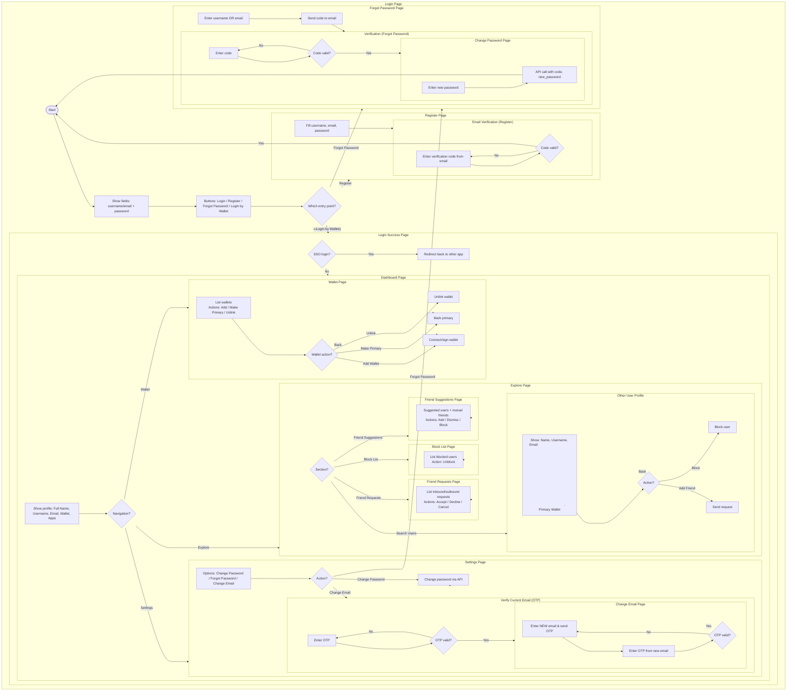

[Mermaid UI Flow Diagram](https://mermaid.live/edit#pako:eNrtWOlu2zgQfhVCQBcN6tRJmlNYdJE4NlAgiQOrbbArBwYt0TIRWdRSVNJsnHff4SFKlJXjAeofNo_hcObjzDekn7yIxcTzvUXKHqIl5gJ9P59mCH34gH4UhKMRjKMF4-g0iliZCfQHClhEcYpO83yaGdHt7W10wRKaoWucENmVE0U5TzjOl3pKzoRTrxaberdSCqGL61kgYOuPofq53bLDI8ZXYbCUJlCSxoWPSjAqwyvSJytMU_QJ5bgoHhiPa11npRAsK0Lz6xvL-mhCEloIcKqPQHHCBJihF8OIFpo_ohucpkS0TAOXvlYGVW2jX4OgRAdLRiPyNPVuljRaIpIJ_ohyRjPx19R7bhtY6dGrWkrk5LpC62PESQzaAPZia-qttbFBGUWkKLoWVp6urc8K8M4tWlBI9XrIjrximcWryyqSxU6EWPw7g6RpKcSJI2xDZTIb0TQN5ZcNhR5SsdBrh4KWVShPZj8Jp4tHx6p6ZzMLuw5VVKkujbCgDMCvLNlqWDGArAmHmbTvviksswktOFtpmxx5Y8k5iWgBshAmavQepzSu46MWUED_TYq1jcJOiSu2Nht0Yd4OdJXPbejd8w43YsI9g9HsW5aXwrhfnQIaTxyfR7MAbAnll0ZFsNa80qJA0bKm-dpJjeqTcs-oZfBWw9jGUUk7nHGz5RtHMuo4ksESZwlxU2S0eTCjzYOxzrgqwCU98ALqg-vZFXkwjmTkoR3tMH-a0_D0-huKICPRAxVL5XBPSs82pUGbcl8vrMjIxlk7kHS-m-x-heaNhGX65oqa8QMgExLdAeBBMEaplGxQpJmt0QYhKDfhhMSUk0igOYZZCCgmloAGzvPbjpUS_3NcLOcM6xNqu2Qnu92x0-CLK2r9OIcgXjBdoXLOFjQlPhqVAP-VIqYflqKGmqI0WfZk8Sysjit8D0DAN01UONdIaP3qbJRYY4VyMSBC0CyRCJlWW2L4K08ZJ2tkGu15bdC6YvEOlCrN3SBVs4CRI2ghCmbjXDpVhObXR-047yrHRmbYYIxgdhoJnaW6UeNkN1FQVYLuMlO3WpvLuhXMZC80M1WmoHuKEaTTrdbp4NvS-c4S2m2JclEu0dSmu52E0RCoCPARDUrO4Wqg1aCP4-_XNfn9dJgapux4lX0w1ma7nw1iNoLOqjYHWoNdCZl9RtVr9Fd50wSjRXzDBvFdDW90FYF7aCFrRu0UyDWoXjqm6rCkymbdkWIvO68307w4rEtEtchV0eAnJzqceYmD1tqVXDrtulNLzwE2DSGLys3sAi4lofxCD2q--HPO-191hEGSncYyjS7xHcQ6pysMN9E--pGlNLuzKmw-mR1wK630JgqBGyenbtxIlnvV10CYjONwwLIMqLpf0CQzFupMqplmQ0_TWq3JdMJLzO-AYVXnDTXaR7lYt0L98z4bzqCwvFE1DJF2n5mZlDfJhpg9tWH9RAhIC-yhe78OCObwhpAVpJBYjGWpk71O6RGnMhsm5N-SFEIt0EN2pGvVWcogSuUZywWqpzqv7BCUSQL6ZIzVmzQHO3PdGg_AqLZ-XF7rkmnhGc9kJVXl1O-uoOj35_fnHZ-eJT3nOT9--QqhY0-xw9jhuvEm1-moV1mpuE69XrjONE0wrWx1dKg8k0tVI9RJKJ9R71iq6Klxlet4IjlpH25QQ-stN2nUEZrNWZnFfVYK1ahcalcWuNDnAqoJvHaAWYm8reEsIqmrUznzqqmWcMImFbkGnl00DJxLIRIrsJpG-VDY1Jy76G0LNugr7CK6FmSBtsgIVOagT2hVihKncO2QCjrL8TktVhQeQ33tu6ux01yv5yWcxp4veEl63opwoEHoek9SZOpBsKzANh-aKU2WQOTT7BkW5Tj7h7FVtY6zMll6_gKnBfTKPMaCnFMMKNQisB_hA_knn-cfKA2e_-T98vzt_d3Dz8e7x0fHxzsnB7t7BydHPe_R80_2Px8e7xx-2T_4cnh0dHBw8tzz_lOb7n3e2z_Z2T_Z35Piu3t7PQ-eboLxS_1vo_rT8fl_DW5W3Q)
