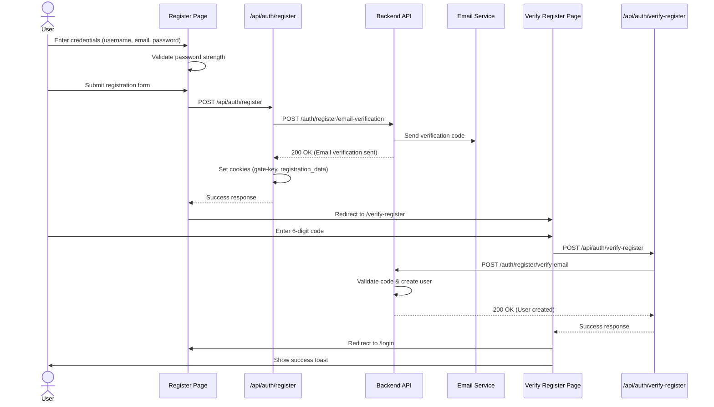
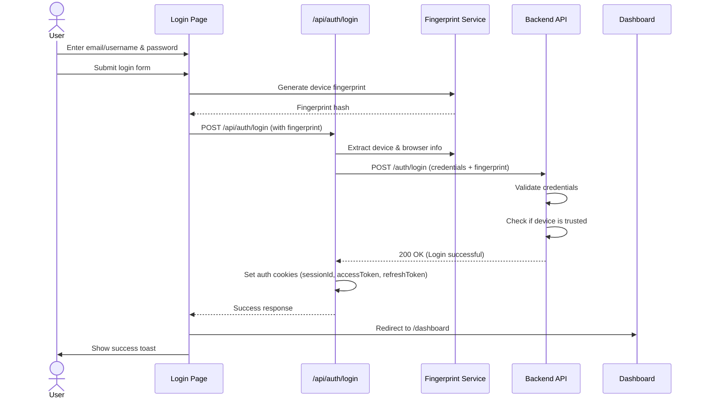
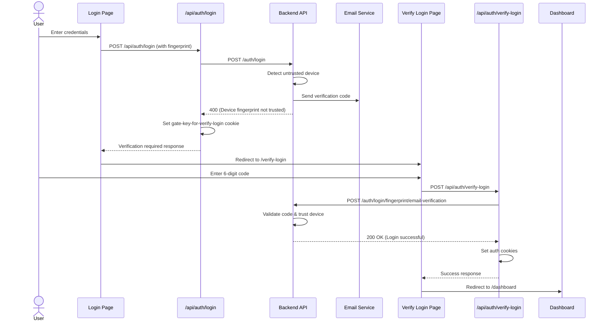
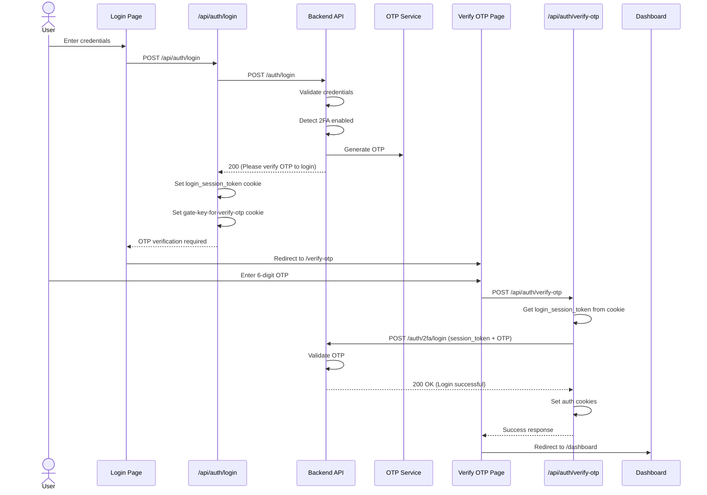
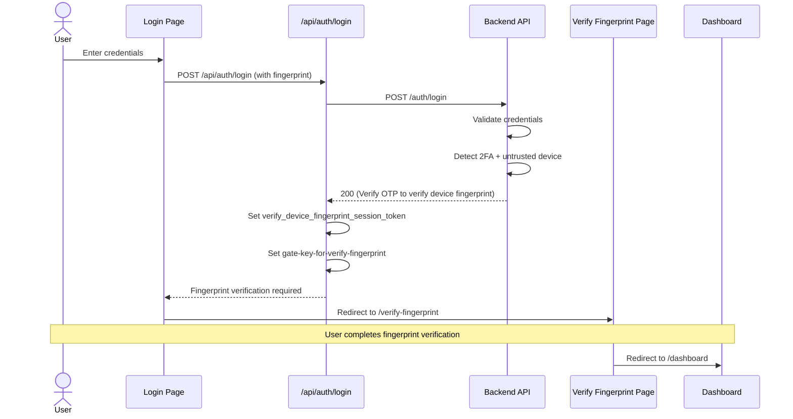
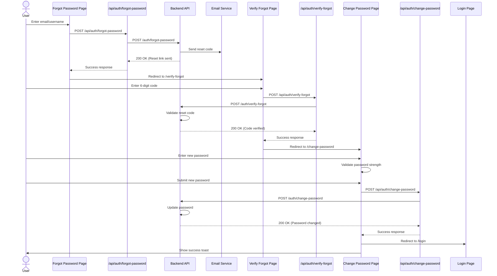
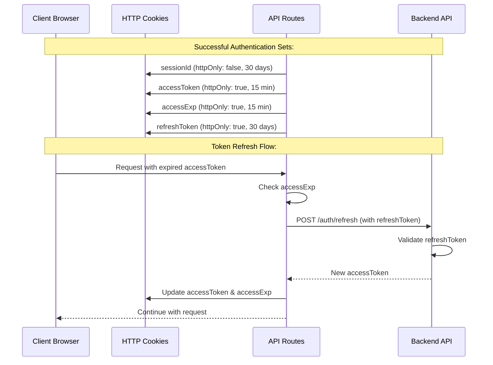

# Authentication Flow Sequence Diagrams

This document contains sequence diagrams for all authentication flows in the Decode Frontend application.

## 1. Registration Flow

## 2. Login Flow (Standard - Trusted Device)

## 3. Login Flow (Untrusted Device - Email Verification)

## 4. Login Flow (2FA Enabled - OTP Verification)

## 5. Login Flow (2FA + Untrusted Device - Fingerprint Verification)

## 6. Forgot Password Flow

## 7. Authentication State Management

## Cookie Summary

### Authentication Cookies (After Successful Login)
- **sessionId**: Session identifier (30 days, not httpOnly)
- **accessToken**: Short-lived access token (15 minutes, httpOnly)
- **accessExp**: Access token expiration timestamp (15 minutes, httpOnly)
- **refreshToken**: Long-lived refresh token (30 days, httpOnly)

### Gate Cookies (Temporary Navigation Guards)
- **gate-key-for-register**: Allows access to register page (60s)
- **gate-key-for-login**: Allows access to login page (60s)
- **gate-key-for-forgot-password**: Allows access to forgot password page (60s)
- **gate-key-for-verify-otp**: Allows access to OTP verification page (5 min)
- **gate-key-for-verify-login**: Allows access to login verification page (5 min)
- **gate-key-for-verify-register**: Allows access to register verification page (60s)
- **gate-key-for-verify-fingerprint**: Allows access to fingerprint verification page (5 min)

### Session Cookies (Temporary Authentication State)
- **login_session_token**: Temporary token for 2FA login flow (5 min)
- **verify_device_fingerprint_session_token**: Temporary token for device verification (5 min)
- **registration_data**: Stores email/username during registration (10 min)
- **verification_required**: Flag indicating verification is needed (10 min)

## Security Features

1. **Device Fingerprinting**: Tracks trusted devices using browser fingerprints
2. **Two-Factor Authentication (2FA)**: Optional OTP verification for enhanced security
3. **Email Verification**: Required for new registrations and untrusted devices
4. **HttpOnly Cookies**: Sensitive tokens stored in httpOnly cookies to prevent XSS
5. **Token Expiration**: Short-lived access tokens with refresh token rotation
6. **Request Timeouts**: All API calls have 10-20 second timeouts
7. **Password Strength Validation**: Enforces strong password requirements
   - Minimum 8 characters
   - At least one uppercase letter
   - At least one number
   - At least one special character
