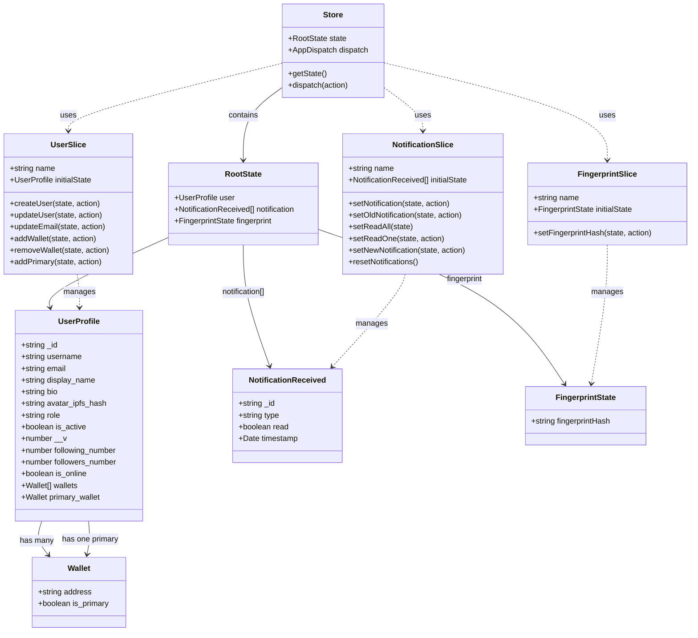

# Redux State Management Diagram
This class diagram shows the structure of Redux slices, state interfaces, and their relationships.

```mermaid
classDiagram
    class Store {
        +RootState state
        +AppDispatch dispatch
        +getState()
        +dispatch(action)
    }

    class RootState {
        +UserProfile user
        +NotificationReceived[] notification
        +FingerprintState fingerprint
    }

    class UserProfile {
        +string _id
        +string username
        +string email
        +string display_name
        +string bio
        +string avatar_ipfs_hash
        +string role
        +boolean is_active
        +number __v
        +number following_number
        +number followers_number
        +boolean is_online
        +Wallet[] wallets
        +Wallet primary_wallet
    }

    class Wallet {
        +string address
        +boolean is_primary
    }

    class NotificationReceived {
        +string _id
        +string type
        +boolean read
        +Date timestamp
    }

    class FingerprintState {
        +string fingerprintHash
    }

    class UserSlice {
        +string name
        +UserProfile initialState
        +createUser(state, action)
        +updateUser(state, action)
        +updateEmail(state, action)
        +addWallet(state, action)
        +removeWallet(state, action)
        +addPrimary(state, action)
    }

    class NotificationSlice {
        +string name
        +NotificationReceived[] initialState
        +setNotification(state, action)
        +setOldNotification(state, action)
        +setReadAll(state)
        +setReadOne(state, action)
        +setNewNotification(state, action)
        +resetNotifications()
    }

    class FingerprintSlice {
        +string name
        +FingerprintState initialState
        +setFingerprintHash(state, action)
    }

    %% Relationships
    Store --> RootState : contains
    RootState --> UserProfile : user
    RootState --> NotificationReceived : notification[]
    RootState --> FingerprintState : fingerprint

    UserProfile --> Wallet : has many
    UserProfile --> Wallet : has one primary

    UserSlice ..> UserProfile : manages
    NotificationSlice ..> NotificationReceived : manages
    FingerprintSlice ..> FingerprintState : manages

    Store ..> UserSlice : uses
    Store ..> NotificationSlice : uses
    Store ..> FingerprintSlice : uses
```
