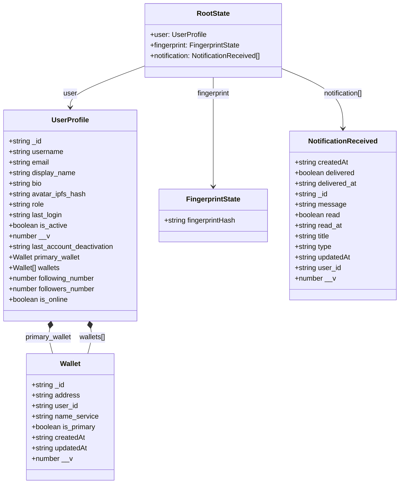

# Redux State Class Diagram

This diagram represents the complete Redux store structure for the Decode Frontend application.

## Store Structure Overview

### State Slices

1. **User Slice** (`userSlice.ts`)
   - Manages user profile data including authentication, profile information, and wallet connections
   - Handles wallet management (add, remove, set primary)
   - Tracks social metrics (followers, following)

2. **Fingerprint Slice** (`fingerprintSlice.ts`)
   - Stores device fingerprint hash for security and tracking purposes
   - Simple state with single string value

3. **Notification Slice** (`notificationSlice.ts`)
   - Manages array of notifications
   - Handles real-time notification updates via socket events
   - Tracks read/unread status and delivery status

### Key Features

- **Type Safety**: Full TypeScript integration with `RootState` and `AppDispatch` types
- **Custom Hooks**: `useAppDispatch` and `useAppSelector` for type-safe Redux usage
- **Redux Provider**: Wraps application with Redux store context
- **Immutable Updates**: Uses Redux Toolkit's Immer for safe state mutations

### Actions Summary

#### User Actions
- `createUser`: Initialize user profile
- `updateUser`: Update profile fields (avatar, display name, bio)
- `updateEmail`: Update user email
- `addWallet`: Add new wallet to user's wallets
- `removeWallet`: Remove wallet by address
- `addPrimary`: Set primary wallet and update is_primary flags

#### Fingerprint Actions
- `setFingerprintHash`: Store device fingerprint

#### Notification Actions
- `setNotification`: Replace all notifications
- `setOldNotification`: Append older notifications (pagination)
- `setReadAll`: Mark all notifications as read
- `setReadOne`: Mark single notification as read
- `setNewNotification`: Add new notification from socket event
- `resetNotifications`: Clear all notifications
